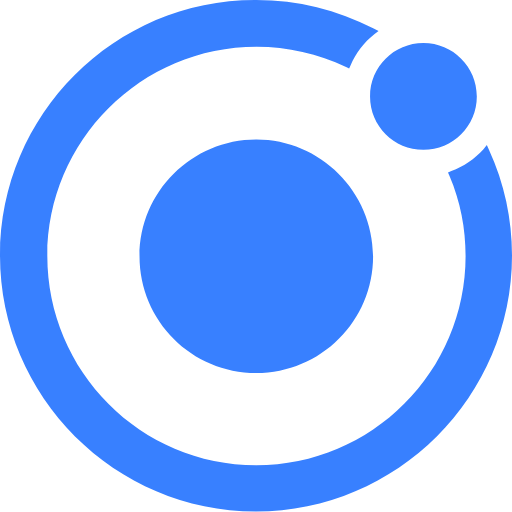
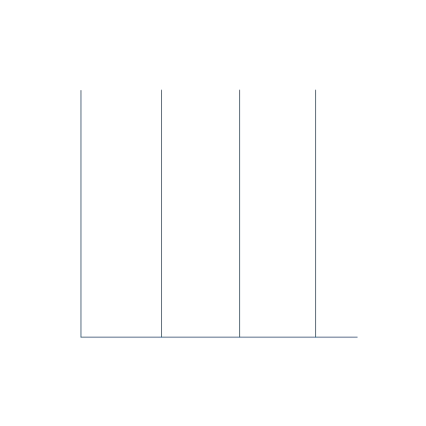

<h1 align="center">
  <b>Hi, I'm Ángel Calle</b>
  
  <br>
  <small>a full-stack developer living in Madrid</small>
</h1>

<div style="width: 100%; height: 120px; position: relative; overflow: hidden;">
  
  <div style="position: absolute; top: 0; left: 0; width: 100%; height: 120px; background: linear-gradient(to top, rgba(255, 140, 0, 1), rgba(255, 140, 0, 0));"></div>
</div>
<br><br>


## Who I Am 

I am a passionate and proactive developer with an obsession for clean code and optimal performance. My insatiable curiosity drives me to constantly explore new technologies and innovate in every project. I always seek challenges that propel my professional growth and am motivated by finding creative and efficient solutions. My goal is not just to meet but to exceed expectations in every development.

```ts
const Angel_Calle = {
  summary    : 'builds digital solutions for SaaS products & B2B marketing',
  roles      : [ 'Software Engineer Full Stack', 'Programmer Analyst', 'Problem Solver' ],
  interests  : [ 'Artificial Intelligence', 'Best Practices', 'Keeping Up to Date' ],
  key_values : [ 'curious', 'collaborative', 'creative' ],
  nickname   : ( 'Cekas' || 'SrCekas' )
}
```
<br><br>


## What I know 

As a corporate applications developer, I specialize in using Angular and microservices with Spring Boot. I take pride in ensuring code quality through thorough unit testing and always adhering to best development practices.

I have a strong interest in hexagonal architecture and event-driven programming, which allows me to design modular and scalable solutions. Additionally, I have experience working with both relational and non-relational databases, providing great flexibility in data management.

One of my key focuses is the implementation of continuous deployment and continuous integration, ensuring that every update is efficient and reliable. I am always looking to improve and stay updated with the latest technologies and methodologies, aiming to optimize every project I am involved in.

In recent years, I have developed a deep interest in artificial intelligence. I have started working on small projects to train myself and explore this vast field, which I believe has tremendous potential for the future. This new passion drives me to keep learning and experimenting, seeking to integrate these advanced technologies into my developments.
<br><br>


## <b>How to reach me</b>
<a href="https://linkedin.com/in/angelcalleserrano/" target="_blank"></a>
<a href="mailto:angelcalle@zoho.com" target="blank"></a>
<a href="https://www.github.com/github" target="_blank"></a>
<br><br><br>

## <b> Skills | Languages, Frameworks, and Tools </b>
<div align="center">
  <table>
      <tr>
          <td style="font-weight: bold; padding-right: 10px; vertical-align: center;">Frontend:</td>
          <td>
            
            
            
            
            
            
            
            
            
            
              
          </td>
      </tr>
      <tr>
          <td style="font-weight: bold; padding-right: 10px; vertical-align: center; border: none;">Backend:</td>
          <td>
            
            
            
            
            
            
            
            
            
          </td>
      </tr>
      <tr>
          <td style="font-weight: bold; padding-right: 10px; vertical-align: center; border: none;">DevOps:</td>
          <td>
            
            
            
            
            
            
          </td>
      </tr>
      <tr>
          <td style="font-weight: bold; padding-right: 10px; vertical-align: center; border: none;">Database:</td>
          <td>
            
            
            
            
            
            
          </td>
      </tr>
      <tr>
          <td style="font-weight: bold; padding-right: 10px; vertical-align: center; border: none;">Version Control:</td>
          <td>
            
            
            
          </td>
      </tr>
      <tr>
          <td style="font-weight: bold; padding-right: 10px; vertical-align: center; border: none;">Other Tools:</td>
          <td>
            
            
            
            
            
            
            
            
            
          </td>
      </tr>
  </table>
</div>
<br><br>


## <b> Projects  </b> 
<div align="center">
  <a href="https://github.com/AngelCalle/spring-boot-mongo-db"></a>
  <a href="https://github.com/AngelCalle/mental-health_voice-generator"></a>
  <a href="https://github.com/AngelCalle/spring-boot-interceptor-valid-headers"></a>
  <a href="https://github.com/AngelCalle/generate-xlsx-spring-boot"></a>
  <a href="https://github.com/AngelCalle/SonarDockerCodeQuality"></a>
  <a href="https://github.com/AngelCalle/angular-read-xlsx-csv"></a>
</div>
<br><br>


## <b>Github Stats</b>
<div align="center">
  
  
</div>

<div align="center">
  
</div>

<div align="center">
  
  
</div>

<div align="center">
  <a href="https://git.io/streak-stats">
    
  </a>
</div>
<br><br>


------
<div align="center">
  <p>Credit: <a href="https://github.com/AngelCalle">Ángel Calle</a> Last Edited on: <time datetime="2024-06-21">21/06/2024</time></p>
</div>
